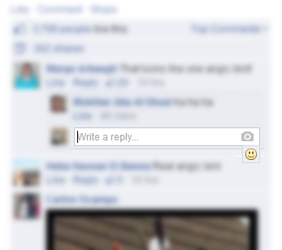

#Facebook Emoji UserScript#

This is a UserScript which adds an Emoji selector in Facebook. 

##How to Install##

* Firefox: Install `script.user.js` via [Greasemonkey](https://addons.mozilla.org/firefox/addon/748)
* Chrome: Install `script.user.js` via [Tampermonkey](https://chrome.google.com/webstore/detail/tampermonkey/dhdgffkkebhmkfjojejmpbldmpobfkfo?hl=en)
* For other, please see [here](http://userscripts.org/about/installing).

##What Will Your Code Do?##
It simply adds a Emoji selector panel in Facebook when you are commenting. The code is open-sourced so you can take a look at it if you want.

---
This is distributed under the MIT License. See `LICENSE` for details.